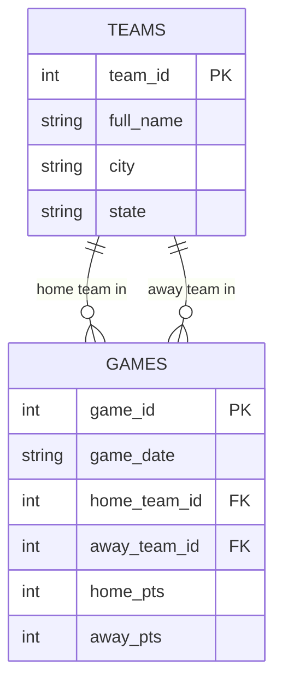
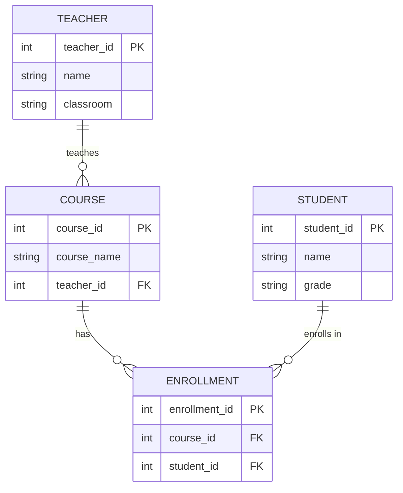

**Before you start:** rename this file to `unit3b_lastname.md`, using your own last name. Read `unit3b_Walkthrough.md` first. Commit and push when you're done.

**Name:**

---

# Unit 3b — Keys and Relationships

## 1. Which key?

For each table, decide: is the primary key **natural** (a real-world value that already exists, like an email) or **surrogate** (a made-up ID number)? Is it **composite** (more than one column)?

| Table | Primary key | Natural or surrogate? | Composite? |
|---|---|:-:|:-:|
| `teams` in `nba_5seasons.db` | `team_id` | surrogate | no |
| `player_season_stats` in `nba_5seasons.db` | player_id | surrogate | no |
| A US state table | `state_abbrev` (OH, MI, PA…) | natural | yes |
| The school's student records | `student_id` | surrogate | no |

**a.** The school could use a student's full name as the primary key instead of `student_id`. Give one reason that's a bad idea.

**Answer:** Multiple people may have the same name at one point.


## 2. What a foreign key promises

**b.** In `denormalized_demo.db`, `games.home_team_id` is a foreign key to `teams.team_id`. If someone tries to insert a game with `home_team_id = 99` and there is no team 99, what should the database do? What is that rule called?

**Answer:**  It should refuse to do that input, and the rule is called referential integrity.


**c.** If team 6 were deleted from `teams`, what should happen to its rows in `games`? Name two different choices a designer could make.

**Answer:** Either they should refuse to delete the teams, or delete those games too.


## 3. Sort the relationships

**Choose from:** One-to-one · One-to-many · Many-to-many

| # | Relationship | Type |
|:-:|---|---|
| 1 | One team → its games this season | one-to-many |
| 2 | Students ↔ the courses they're enrolled in | many-to-many |
| 3 | A person → their Social Security number | one-to-one |
| 4 | A customer → their orders | one-to-many |
| 5 | Movies ↔ the actors in them | many-to-many |
| 6 | A country → its capital city | one-to-one |

**d.** Pick either many-to-many row. Relational databases can't store a many-to-many directly. What table do you add, and what columns does it need?

**Answer:** You would need to add a connection table, with columns of both keys


**e.** Not every database uses tables and keys. In a **graph** database (like the one behind Instagram's follow list), the same "who follows whom" relationship is stored as what two things? In a **key-value** store, how is a relationship handled?

**Answer:** It is stored as nodes, and relationships (edges)


## 4. Your first ER diagram

Here is the `denormalized_demo.db` fixed version as a Mermaid diagram. It already renders — push and look at it on GitHub or preview it in VS Code.



**Now make your own, using AI.** Follow the four steps in the walkthrough: plan it, prompt the AI, proof it, test it. A school schedule has these entities: **STUDENTS**, **COURSES**, **TEACHERS**, and an **ENROLLMENTS** junction table. Rules:

- One teacher teaches many courses; each course has one teacher.
- Students take many courses; courses have many students. (That's what ENROLLMENTS is for.)

Give every entity a primary key and at least two attributes. Mark the foreign keys.



**Paste the prompt you gave the AI.** If you used a PowerPoint picture, add the picture to your repo too.

```text
 create a mermaid reference graph for this.


There's four entities. Teacher, course, enrollments, students. All of these have primary keys.


Teacher has 2 attributes, name and classroom.

Course has 2 attributes. Course name, teacher.

enrollments have 2 attributes. Course and student (Foreign keys)

Students have 2 attributes. Name and grade.


One teacher teaches many courses, each course has one teacher.

Students take many courses, courses have many students (what enrollments is for) 
```

**f.** Which entity has two foreign keys? What should its primary key be?

**Answer:** Enrollment. It's own id.


**g.** What did you have to fix in the AI's diagram? If you didn't change anything, what did you check to make sure it was right?

**Answer:** I didn't change anything. I made sure it was correct by checking the relationship lines.


## Closing 3b — Vocabulary

| Term | Your definition |
|---|---|
| Entity | A node that contains attributes, or primary keys |
| Attribute | An aspect that an entity can contain |
| Natural key | A key that is individual, and is inherently an attribute and a key |
| Surrogate key | A key (typically an id) that is made up by the user |
| Composite key | A key that is connected to more than one column. |
| Referential integrity | A rule that prevents end-users from creating data changes that do not follow the architecture of the graph or database. |
| Junction table | A way to connect a many-to-many relation in data |
| Cardinality | How many records can be related to each other |

**Partner check:** trade files. Read your partner's Mermaid code out loud, one relationship line at a time, as English ("one teacher, many courses"). If it doesn't read right, one of you has the crow's foot on the wrong end.
